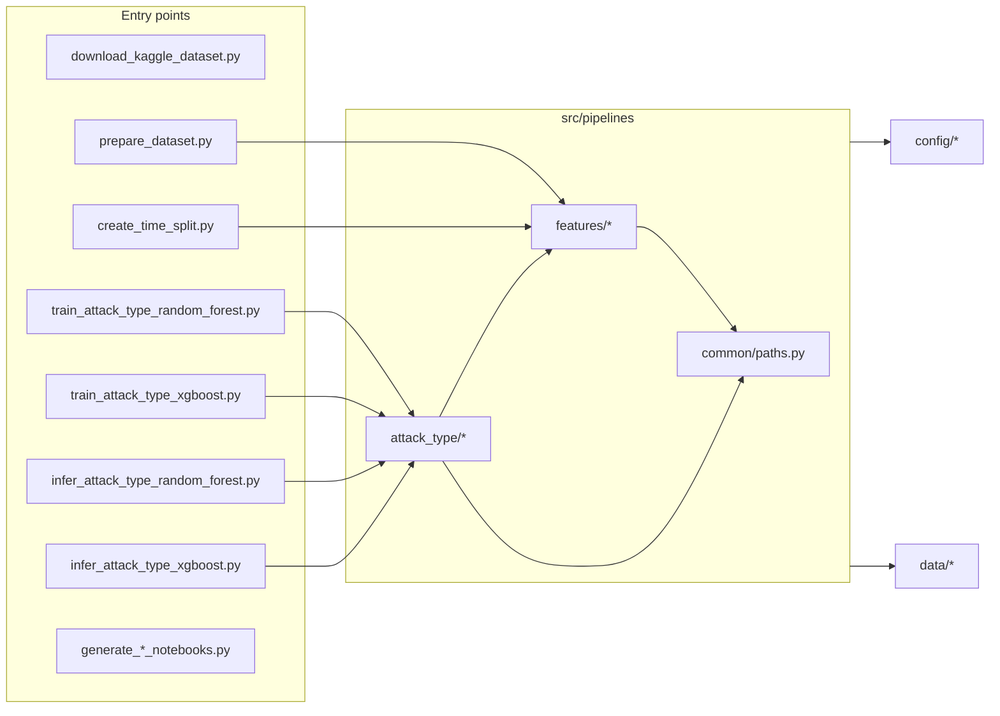

# Project Architecture Blueprint — ML Cybersecurity Attacks

Generated: 2025-12-30 (local workspace)

## 1. Architecture Detection and Analysis

### Technology stack (detected)

- Primary language: Python
- Core ML/data stack: `pandas`, `numpy`, `scikit-learn`, optional `xgboost` (see [requirements.txt](requirements.txt))
- Notebook tooling: `jupyter`, `ipykernel`, `nbformat`-based notebook generation (see [requirements.txt](requirements.txt) and [entrypoints/generate_experiment_notebooks.py](entrypoints/generate_experiment_notebooks.py))
- Testing: `pytest` (see [requirements.txt](requirements.txt) and [tests/](tests/))

### Architectural pattern (detected)

Primary pattern: **Layered “ML pipelines as code” repository** (single-repo monolith) with explicit execution entrypoints.

Key signals:

- **Staged artifact layout** under [data/](data/) (raw → preprocessed → features → predictions)
- **Reusable pipeline modules** under [src/pipelines/](src/pipelines/)
- **Thin orchestration scripts** under [entrypoints/](entrypoints/) that call pipeline code
- **Config separated** into [config/](config/) (notably a canonical baseline feature config)
- **Reports and notebooks** as “consumers” of the staged artifacts rather than being the source of truth

## 2. Architectural Overview

This repo implements a reproducible workflow around a small number of explicit, file-based contracts:

- **Prepared dataset contract** (cleaned data + split + class map + audit + manifest)
- **Model training contract** (timestamped run dir containing model + metrics + predictions + manifest)
- **Model inference contract** (timestamped run dir containing predictions + manifest)

Guiding principles expressed in code:

- Keep I/O at the edges (entrypoints + a few “write_*_artifacts” helpers)
- Keep transforms deterministic given (input artifacts + config + seed)
- Prefer stable, serialized “run manifests” to make results traceable
- Use a canonical baseline feature config to keep experiments comparable

## 3. Architecture Visualization (C4-style)

### 3.1 C4 Context (people + system)

```mermaid
flowchart TB
  user[User / CI Job / Scheduler] --> cli[Entry points (entrypoints/*.py)]
  cli --> pipes[Pipeline library (src/pipelines/*)]

  pipes --> cfg[Configuration (config/*)]
  pipes --> data[(Staged artifacts (data/*))]

  data --> nb[Notebooks (notebooks/*)]
  data --> rep[Reports (reports/*)]

  cli --> kaggle[Kaggle CLI (external)]
```

### 3.2 C4 Container/Component (repo-internal components)



## 4. Core Architectural Components

### 4.1 Data layout (staged artifacts)

- Raw snapshots: [data/01-raw/](data/01-raw/)
- Prepared datasets: [data/02-preprocessed/](data/02-preprocessed/)
- Features stage: [data/03-features/](data/03-features/) (present as a stage, may be expanded later)
- Model artifacts and predictions: [data/04-predictions/](data/04-predictions/)

The code treats these folders as part of the architecture contract, not “incidental output.”

### 4.2 Entry points (thin orchestration)

Entry points are intentionally small, typically doing:

1) CLI arg parsing
2) repo-root resolution + `sys.path` setup
3) calling the corresponding pipeline function

Examples:

- Dataset preparation wrapper: [entrypoints/prepare_dataset.py](entrypoints/prepare_dataset.py)
- Training wrappers: [entrypoints/train_attack_type_random_forest.py](entrypoints/train_attack_type_random_forest.py), [entrypoints/train_attack_type_xgboost.py](entrypoints/train_attack_type_xgboost.py)
- Inference wrappers: [entrypoints/infer_attack_type_random_forest.py](entrypoints/infer_attack_type_random_forest.py), [entrypoints/infer_attack_type_xgboost.py](entrypoints/infer_attack_type_xgboost.py)

### 4.3 Pipeline library (reusable code)

#### 4.3.1 Common utilities

- Repo path conventions: [src/pipelines/common/paths.py](src/pipelines/common/paths.py)

Responsibilities:

- Centralize directory layout assumptions (`data/`, `config/`, etc.)
- Keep entrypoints and notebooks consistent

#### 4.3.2 Feature/dataset preparation

- Dataset prep contract & manifest writing: [src/pipelines/features/prepare_dataset.py](src/pipelines/features/prepare_dataset.py)
- Time-aware split generation: [src/pipelines/features/time_split.py](src/pipelines/features/time_split.py)
- Baseline feature config loading/applying: [src/pipelines/features/baseline_feature_config.py](src/pipelines/features/baseline_feature_config.py)

Responsibilities:

- Convert a raw CSV snapshot into a prepared dataset directory
- Generate a stable `row_id` and a shared split file keyed by `row_id`
- Produce a baseline feature audit and a canonical baseline feature config

#### 4.3.3 Attack Type (multiclass classification) pipelines

- Training utilities (shared between model implementations): [src/pipelines/attack_type/training_utils.py](src/pipelines/attack_type/training_utils.py)
- Train Random Forest: [src/pipelines/attack_type/train_random_forest.py](src/pipelines/attack_type/train_random_forest.py)
- Train XGBoost: [src/pipelines/attack_type/train_xgboost.py](src/pipelines/attack_type/train_xgboost.py)
- Inference utilities: [src/pipelines/attack_type/inference_utils.py](src/pipelines/attack_type/inference_utils.py)
- Inference pipelines: [src/pipelines/attack_type/infer_random_forest.py](src/pipelines/attack_type/infer_random_forest.py), [src/pipelines/attack_type/infer_xgboost.py](src/pipelines/attack_type/infer_xgboost.py)

Responsibilities:

- Load the “latest prepared dataset” (by manifest timestamps)
- Apply baseline feature transforms/drops
- Build preprocessing (impute + one-hot for categoricals)
- Train or load a model pipeline
- Write run artifacts to timestamped directories

### 4.4 Notebooks and notebook generation

Notebooks are treated as an experimentation layer, but generated notebooks explicitly reuse the same artifact contracts:

- Attack Type notebook scaffolding: [entrypoints/generate_experiment_notebooks.py](entrypoints/generate_experiment_notebooks.py)
- Anomaly score regression notebook scaffolding: [entrypoints/generate_anomaly_score_notebooks.py](entrypoints/generate_anomaly_score_notebooks.py)

### 4.5 Reporting

Reports are narrative summaries that should link to artifacts/manifests rather than duplicating them:

- Reporting conventions: [reports/README.md](reports/README.md)

## 5. Architectural Layers and Dependencies

### 5.1 Layer model (as implemented)

- **Layer 1: Execution** — [entrypoints/](entrypoints/)
- **Layer 2: Pipelines** — [src/pipelines/](src/pipelines/)
- **Layer 3: Contracts/Artifacts** — [data/](data/), [config/](config/)
- **Layer 4: Exploration & narrative** — [notebooks/](notebooks/), [reports/](reports/)

### 5.2 Dependency rules (enforced by convention)

- Entry points may import pipeline modules.
- Pipeline modules should not import entrypoints.
- Pipeline modules may read config and data artifacts.
- Notebooks and reports consume artifacts; they should not become the canonical source of pipeline logic.

### 5.3 Concrete dependency flow (observed)

- Attack Type training depends on:
  - repo paths: [src/pipelines/common/paths.py](src/pipelines/common/paths.py)
  - baseline feature transforms: [src/pipelines/features/baseline_feature_config.py](src/pipelines/features/baseline_feature_config.py)
  - prepared dataset selection and loading: [src/pipelines/attack_type/training_utils.py](src/pipelines/attack_type/training_utils.py)

- Attack Type inference depends on:
  - trained model selection/loading: [src/pipelines/attack_type/inference_utils.py](src/pipelines/attack_type/inference_utils.py)
  - prepared dataset selection and loading: [src/pipelines/attack_type/training_utils.py](src/pipelines/attack_type/training_utils.py)

## 6. Data Architecture

### 6.1 Prepared dataset contract

Produced by:

- [entrypoints/prepare_dataset.py](entrypoints/prepare_dataset.py) → [src/pipelines/features/prepare_dataset.py](src/pipelines/features/prepare_dataset.py)

Written to:

- [data/02-preprocessed/](data/02-preprocessed/) under a caller-supplied folder name (often date-stamped)

Expected artifacts in a prepared dataset folder:

- `cleaned.parquet` (preferred) or `cleaned.csv`
- `split.csv` (shared stratified split)
- `attack_type_classes.json` (label order and mapping)
- `feature_audit.csv` (heuristic column audit)
- `baseline_feature_config.json` (snapshot baseline config)
- `manifest.json` (contract index + metadata)

The manifest includes:

- `created_utc`, `raw_csv_path`, `rows`, `cols`, `seed`, split `fractions`
- `artifacts.*` pointing at the produced files

### 6.2 Canonical baseline feature config

The canonical baseline config lives at:

- [config/baseline_feature_config.json](config/baseline_feature_config.json)

Dataset preparation writes:

- a snapshot copy in the prepared folder
- optionally overwrites the canonical config path when `baseline_feature_config_path` is provided

Pipeline modules load and apply it via:

- [src/pipelines/features/baseline_feature_config.py](src/pipelines/features/baseline_feature_config.py)

### 6.3 Training run contract

Produced by:

- [src/pipelines/attack_type/train_random_forest.py](src/pipelines/attack_type/train_random_forest.py)
- [src/pipelines/attack_type/train_xgboost.py](src/pipelines/attack_type/train_xgboost.py)

Written to:

- `data/04-predictions/attack_type/training/<YYYYMMDD_HHMMSS>/`

Typical artifacts:

- `attack_type_<model>_model.joblib`
- `attack_type_<model>_metrics.json`
- `attack_type_<model>_test_predictions.csv`
- `attack_type_<model>_manifest.json`

### 6.4 Inference run contract

Produced by:

- [src/pipelines/attack_type/infer_random_forest.py](src/pipelines/attack_type/infer_random_forest.py)
- [src/pipelines/attack_type/infer_xgboost.py](src/pipelines/attack_type/infer_xgboost.py)

Written to:

- `data/04-predictions/attack_type/inference/<YYYYMMDD_HHMMSS>/`

Typical artifacts:

- `attack_type_<model>_<split>_predictions.csv`
- `attack_type_<model>_<split>_manifest.json`

### 6.5 Time-aware split contract (optional/additive)

Produced by:

- [entrypoints/create_time_split.py](entrypoints/create_time_split.py) → [src/pipelines/features/time_split.py](src/pipelines/features/time_split.py)

Written to:

- a CSV in the prepared dataset folder (default `split_time_70_15_15.csv`)
- updates the prepared dataset `manifest.json` to reference the artifact

## 7. Cross-Cutting Concerns Implementation

### 7.1 Authentication & authorization

Not implemented at the application level.

- Kaggle access uses the Kaggle CLI and user-local credentials (see [entrypoints/download_kaggle_dataset.py](entrypoints/download_kaggle_dataset.py)).

### 7.2 Error handling & resilience

Patterns observed:

- Fail-fast with clear messages when required artifacts are missing.
- Defensive fallbacks for parquet dependencies (fall back to CSV).
- Explicit error messaging for sklearn version mismatch when loading models.

Examples:

- Parquet write fallback: [src/pipelines/features/prepare_dataset.py](src/pipelines/features/prepare_dataset.py)
- Parquet read fallback in time-split entrypoint: [entrypoints/create_time_split.py](entrypoints/create_time_split.py)
- Model load mismatch guidance: [src/pipelines/attack_type/inference_utils.py](src/pipelines/attack_type/inference_utils.py)

### 7.3 Logging & monitoring

Current pattern: print-based run summaries from entrypoints/pipelines.

If/when expanding:

- Prefer structured logging (JSON) inside entrypoints.
- Keep pipeline functions returning data/paths/metrics so entrypoints can log them.

### 7.4 Validation

Observed validation is pragmatic and local:

- Required artifact checks (manifests exist, split join produces rows)
- Label mismatch checks between cleaned dataset and split.csv during join

Example:

- split join and mismatch detection: [src/pipelines/attack_type/training_utils.py](src/pipelines/attack_type/training_utils.py)

### 7.5 Configuration management

- Canonical baseline feature config in [config/baseline_feature_config.json](config/baseline_feature_config.json)
- Visualization config in [config/visualization.json](config/visualization.json) used by anomaly score notebooks

## 8. Service Communication Patterns

This repository is currently a single-process, local filesystem-oriented application.

- No network APIs or microservice communication are implemented.
- “Communication” between components is performed through staged artifacts and manifests.

## 9. Technology-Specific Architectural Patterns (Python)

- CLI entrypoints via `argparse` and `if __name__ == '__main__'` guards
- Typed dataclasses used for artifact path bundles
- Scikit-learn composition:
  - `ColumnTransformer` + `Pipeline`
  - `SimpleImputer` + `OneHotEncoder`
- Model artifact persistence via `joblib`

## 10. Implementation Patterns

### 10.1 Interface design patterns

- Prefer small functions with explicit inputs/outputs.
- Use dataclasses for return objects representing file contracts.

Examples:

- prepared dataset artifacts: [src/pipelines/features/prepare_dataset.py](src/pipelines/features/prepare_dataset.py)
- latest prepared dataset selection: [src/pipelines/attack_type/training_utils.py](src/pipelines/attack_type/training_utils.py)

### 10.2 Training pipeline template (implemented twice)

Common steps (RF and XGBoost):

1) Resolve repo paths
2) Find latest prepared dataset
3) Load baseline feature config
4) Load cleaned data + split file
5) Build splits and feature matrix
6) Build preprocessor
7) Fit model
8) Evaluate (val/test)
9) Write run artifacts + manifest

See:

- RF: [src/pipelines/attack_type/train_random_forest.py](src/pipelines/attack_type/train_random_forest.py)
- XGB: [src/pipelines/attack_type/train_xgboost.py](src/pipelines/attack_type/train_xgboost.py)

### 10.3 Inference pipeline template (implemented twice)

Common steps:

1) Resolve repo paths
2) Find latest trained model (or accept explicit path)
3) Load model
4) Load latest prepared dataset + baseline config
5) Run inference on selected split
6) Write predictions + manifest

See:

- RF: [src/pipelines/attack_type/infer_random_forest.py](src/pipelines/attack_type/infer_random_forest.py)
- XGB: [src/pipelines/attack_type/infer_xgboost.py](src/pipelines/attack_type/infer_xgboost.py)

## 11. Testing Architecture

### 11.1 Test boundaries

- Unit tests for pipeline utilities: [tests/test_attack_type_training_utils.py](tests/test_attack_type_training_utils.py)
- “Compile smoke test” for Python files: [tests/test_python_files_compile.py](tests/test_python_files_compile.py)

### 11.2 Strategy

- Keep tests independent of real datasets by using tiny synthetic dataframes and temp folders.
- Treat artifact contracts (manifest selection, split joins, preprocessing shape) as critical invariants.

## 12. Deployment Architecture

### 12.1 Local execution

- Python virtualenv recommended (documented in [README.md](README.md))
- Run workloads via `python entrypoints/<script>.py`

### 12.2 Containerization

- A [Dockerfile](Dockerfile) exists but is currently empty.

If containerization is adopted, the natural container boundary is:

- a single container image that runs entrypoints as batch jobs

### 12.3 Infrastructure-as-code

- [infra/](infra/) is present as the intended location for provisioning templates (currently documentation-oriented)

## 13. Extension and Evolution Patterns (How to extend safely)

### 13.1 Add a new modeling task (recommended pattern)

Create:

1) A new pipeline package: `src/pipelines/<task_name>/`
2) Shared utilities mirroring Attack Type’s pattern:
   - `<task_name>/training_utils.py`
   - `<task_name>/inference_utils.py`
3) A training pipeline module per model:
   - `<task_name>/train_<model>.py`
4) An inference pipeline module per model:
   - `<task_name>/infer_<model>.py`
5) Thin wrappers in [entrypoints/](entrypoints/) that call the pipeline `main()` functions

Keep invariant:

- All run outputs go into `data/04-predictions/<task_name>/{training|inference}/<timestamp>/` with manifests.

### 13.2 Add new feature engineering

Prefer to extend baseline feature logic in one of two ways:

- Update how the baseline feature config is *generated* during dataset prep:
  - [src/pipelines/features/prepare_dataset.py](src/pipelines/features/prepare_dataset.py)
- Update how baseline transforms are *applied*:
  - [src/pipelines/features/baseline_feature_config.py](src/pipelines/features/baseline_feature_config.py)

### 13.3 Add a new split strategy

Pattern already exists for a second split artifact:

- stratified `split.csv` from dataset prep
- time-aware `split_time_*.csv` from [entrypoints/create_time_split.py](entrypoints/create_time_split.py)

To add a third strategy, implement another “split generator” and update the prepared dataset manifest to reference it.

## 14. Architectural Pattern Examples (Representative)

### Example: “Find latest prepared dataset” selects by manifest timestamp

This pattern makes pipelines resilient to multiple prepared datasets on disk:

- selection logic: [src/pipelines/attack_type/training_utils.py](src/pipelines/attack_type/training_utils.py)

### Example: Baseline feature config applied consistently

- config parsing + transforms: [src/pipelines/features/baseline_feature_config.py](src/pipelines/features/baseline_feature_config.py)

### Example: Training artifacts written as a run directory

- artifact writer: [src/pipelines/attack_type/training_utils.py](src/pipelines/attack_type/training_utils.py)

## 15. Architectural Decision Records (ADRs)

### ADR-001: Use a staged data layout under data/

- Decision: Keep raw/preprocessed/features/predictions as explicit stages.
- Context: Reproducibility and clear lineage matter for ML experiments.
- Consequences:
  - Positive: easy to trace inputs/outputs; consistent automation.
  - Negative: requires discipline to avoid writing “random outputs” outside the stages.

### ADR-002: Use shared split artifacts keyed by row_id

- Decision: Persist split files (`split.csv`, optional time split) and join by stable `row_id`.
- Context: Comparable experiments need identical evaluation rows.
- Consequences:
  - Positive: notebooks and pipelines align on evaluation; avoids accidental resplitting.
  - Negative: the `row_id` contract must remain stable for a given prepared dataset.

### ADR-003: Use a canonical baseline feature config

- Decision: Generate and store baseline feature rules in [config/baseline_feature_config.json](config/baseline_feature_config.json).
- Context: Experiments should compare on the same feature set.
- Consequences:
  - Positive: consistent baseline across training/inference/notebooks.
  - Negative: updating the baseline config can change model behavior; treat config updates like code changes.

### ADR-004: Write run manifests alongside artifacts

- Decision: Every training/inference run emits a manifest JSON linking to inputs and outputs.
- Context: File-based ML workflows need a traceability spine.
- Consequences:
  - Positive: “run cards” enable debugging and reporting.
  - Negative: needs stable schema (avoid breaking changes to manifests).

### ADR-005: Keep entrypoints thin

- Decision: Put orchestration in [entrypoints/](entrypoints/) and core logic in [src/pipelines/](src/pipelines/).
- Consequences:
  - Positive: pipeline logic is testable; entrypoints are easy to schedule/containerize.
  - Negative: requires keeping import paths and repo-root resolution consistent.

## 16. Architecture Governance

Automated checks and conventions:

- Python compilation smoke test: [tests/test_python_files_compile.py](tests/test_python_files_compile.py)
- Unit tests around key utility invariants: [tests/test_attack_type_training_utils.py](tests/test_attack_type_training_utils.py)
- Naming conventions:
  - “attack_type” prefixes on artifacts
  - timestamped run folders
  - manifests as the canonical index for each run

Recommended governance additions (if needed):

- Add schema validation for `manifest.json` files.
- Add a small “contract test” that ensures a training run produces expected filenames.

## 17. Blueprint for New Development

### Development workflow (recommended)

1) Update/refresh raw snapshot:
   - run [entrypoints/download_kaggle_dataset.py](entrypoints/download_kaggle_dataset.py)
2) Create/refresh prepared dataset:
   - run [entrypoints/prepare_dataset.py](entrypoints/prepare_dataset.py)
3) (Optional) Create a time-aware split:
   - run [entrypoints/create_time_split.py](entrypoints/create_time_split.py)
4) Train a model:
   - run [entrypoints/train_attack_type_random_forest.py](entrypoints/train_attack_type_random_forest.py) or [entrypoints/train_attack_type_xgboost.py](entrypoints/train_attack_type_xgboost.py)
5) Run inference:
   - run [entrypoints/infer_attack_type_random_forest.py](entrypoints/infer_attack_type_random_forest.py) or [entrypoints/infer_attack_type_xgboost.py](entrypoints/infer_attack_type_xgboost.py)
6) Summarize results in [reports/](reports/) and link to run manifests.

### Common pitfalls

- Training/inference environment drift: model loading can fail if `scikit-learn` versions differ (handled with an explicit error message in [src/pipelines/attack_type/inference_utils.py](src/pipelines/attack_type/inference_utils.py)).
- Split join failures: if `row_id` generation or split files diverge, joins can produce 0 rows.
- Baseline config drift: treat changes to [config/baseline_feature_config.json](config/baseline_feature_config.json) as behavior changes.

---

## Keeping this blueprint current

Re-generate or update this document whenever you:

- add a new task under `src/pipelines/`
- change prepared dataset artifacts or manifest schema
- change where artifacts are written under `data/`
- introduce new runtime/deployment mechanics (Docker/IaC)
