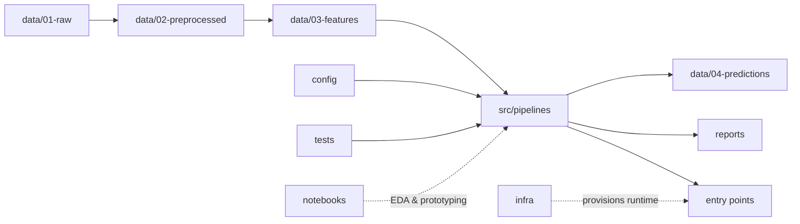

# ML Cybersecurity Attacks

[](LICENSE)

## Project Description

This repository implements a reproducible ML workflow for the Kaggle dataset:

- `teamincribo/cyber-security-attacks`

The primary modeling task currently implemented is **multiclass classification of `Attack Type`**.

It emphasizes:

- A **staged data layout** (raw → preprocessed → features → predictions)
- **Pipelines as code** (feature engineering, training, inference) instead of ad-hoc scripts
- **Explicit entry points** for training and inference (useful for CI, Docker, and scheduled runs)
- **Config separated** from code to support local vs production behaviors
- **Tests from day one** to keep refactors safe
- **Infrastructure as Code** support via `infra/` for reproducible environments

## Technology Stack

This template is intentionally minimal; you choose the libraries that fit your problem.

- **Language:** Python
- **Environment management:** `venv`
- **Dependencies:** `pip` via `requirements.txt`
- **Notebooks:** `jupyter`, stored in `notebooks/`
- **ML stack:** `scikit-learn`, `xgboost`
- **Testing:** `pytest`

## Project Architecture

At a high level, the project is organized around a simple ML lifecycle:



- **Data is tracked by stage** in `data/`.
- **Reusable, testable pipeline code** lives in `src/pipelines/`.
- **Runnable scripts** (training/inference) live in `entrypoints/`.
- **Configuration** lives in `config/` (e.g., local vs prod).
- **Notebooks** are for exploration and experimentation, not production code.
- **Infrastructure as Code** lives in `infra/`.

## Getting Started

### Prerequisites

- Python 3.x installed
- (Optional) Docker installed

## Python Environment Setup

This template assumes an isolated Python environment per project.

1. Create a virtual environment:

```bash
python -m venv .venv
```

1. Activate it:

```bash
# Windows PowerShell
.\.venv\Scripts\Activate.ps1

# macOS/Linux
source .venv/bin/activate
```

1. Install dependencies:

```bash
python -m pip install --upgrade pip
pip install -r requirements.txt
```

## Quick Start: Attack Type workflow

This is the typical end-to-end flow:

1. (Optional) Download + snapshot the Kaggle dataset:

```bash
python entrypoints/download_kaggle_dataset.py
```

1. Prepare the dataset (clean + stratified train/validation/test split):

```bash
python entrypoints/prepare_dataset.py
```

1. Train models (artifacts saved to `data/04-predictions/attack_type/training/<timestamp>/`):

```bash
python entrypoints/train_attack_type_random_forest.py
python entrypoints/train_attack_type_xgboost.py
```

1. Run inference (scores the latest prepared dataset using the latest trained model):

```bash
python entrypoints/infer_attack_type_random_forest.py --split test
python entrypoints/infer_attack_type_xgboost.py --split test
```

1. Run tests:

```bash
pytest
```

1. (Optional) Register an IPython kernel for this env:

```bash
python -m ipykernel install --user --name ml-project-structure --display-name "Python (ml-project-structure)"
```

### Setup

1. Set up your environment using the steps in the [Python Environment Setup](#python-environment-setup) section.

1. Start implementing your project:

- Add your training and inference scripts under `entrypoints/`.
- Add pipeline logic under `src/pipelines/`.
- Add tests under `tests/`.

## Kaggle Dataset

This project is intended to work with the Kaggle dataset:

- `teamincribo/cyber-security-attacks`

### Kaggle API Setup

1. Create a Kaggle API token:

- Kaggle → Account → **Create New API Token**
- This downloads `kaggle.json`

1. Put `kaggle.json` in the standard location:

- **Windows**: `%USERPROFILE%\.kaggle\kaggle.json`
- **macOS/Linux**: `~/.kaggle/kaggle.json`

1. Verify the CLI works:

```bash
kaggle --version
```

### Download + Snapshot Into data/01-raw

Recommended workflow:

1. Download/unzip into `downloads/` (ignored by `.gitignore`).
2. Copy an immutable snapshot into `data/01-raw/` under a dated folder.

If you use the provided entry point script:

```bash
python entrypoints/download_kaggle_dataset.py
```

## Artifacts and conventions

- Prepared datasets are written under `data/02-preprocessed/<output_name>/` and include:
  - `cleaned.parquet` or `cleaned.csv`
  - `split.csv` (shared stratified split)
  - `attack_type_classes.json`
  - `baseline_feature_config.json` and `feature_audit.csv`
  - `manifest.json`
- Training runs are written under `data/04-predictions/attack_type/training/<timestamp>/`.
- Inference runs are written under `data/04-predictions/attack_type/inference/<timestamp>/`.
- Output filenames are prefixed with `attack_type_*` (e.g., `attack_type_xgboost_model.joblib`).

## Dependency note (model compatibility)

Serialized scikit-learn pipelines (`joblib`) are sensitive to library version changes.
This repo pins `scikit-learn` in `requirements.txt` so training/inference stay compatible.

## Project Structure

High-level layout:

```text
Dockerfile               # (Optional) Container build recipe (currently empty)
LICENSE                  # Project license
README.md                # This documentation
requirements.txt         # Python dependencies
config/                 # Configuration (e.g., local vs prod settings)
data/
  01-raw/               # Immutable raw inputs
  02-preprocessed/      # Cleaned/standardized datasets
  03-features/          # Feature matrices / engineered feature sets
  04-predictions/       # Model outputs / predictions
entrypoints/            # Executable scripts (training, inference, batch jobs)
infra/                  # Infrastructure as Code (provisioning/deploy)
notebooks/              # EDA and experiments (kept separate from prod code)
reports/                # Generated reports (figures, summaries, artifacts)
src/
  pipelines/            # Reusable ML pipelines (feature, train, infer)
tests/                  # Unit/integration tests
```

See the folder-level docs for details:

- [config/README.md](config/README.md)
- [data/01-raw/README.md](data/01-raw/README.md)
- [data/02-preprocessed/README.md](data/02-preprocessed/README.md)
- [data/03-features/README.md](data/03-features/README.md)
- [data/04-predictions/README.md](data/04-predictions/README.md)
- [entry points/README.md](entrypoints/README.md)
- [infra/README.md](infra/README.md)
- [notebooks/README.md](notebooks/README.md)
- [reports/README.md](reports/README.md)
- [pipelines/README.md](src/pipelines/README.md)
- [tests/README.md](tests/README.md)

## Key Features

- Clear staged `data/` pipeline (raw → preprocessed → features → predictions)
- Pipelines as reusable code (`src/pipelines/`) instead of one-off scripts
- Explicit operational entry points (`entrypoints/`) to simplify automation
- Infrastructure as Code support (`infra/`) for reproducible environments
- Separate configuration directory (`config/`) to avoid hard-coding behavior
- Tests included from the start (`tests/`)
- Notebooks separated from production code (`notebooks/`)

## Development Workflow

No single workflow is enforced, but the structure is designed to support a pragmatic ML loop:

1. Explore and validate assumptions in `notebooks/`.
2. Turn stable logic into pipelines in `src/pipelines/`.
3. Create runnable scripts in `entrypoints/` for training/inference.
4. Add/expand tests in `tests/` as pipelines stabilize.
5. (Optional) Containerize entry points for reproducible runs.
6. (Optional) Provision/deploy runtime resources via `infra/`.

Branching strategy is not prescribed by this template; a common default is feature branches with pull requests into `main`.

## Coding Standards

Python code should follow:

- PEP 8 formatting
- Type hints where practical (`typing` module)
- PEP 257 docstrings for public functions/classes
- Small, composable functions with clear names
- Tests for critical paths and edge cases

If you want to enforce these standards automatically, consider adding tools like `ruff`/`black`/`mypy` and a CI workflow.

## Testing

This template includes a `tests/` directory so you can start testing early.

Recommended approach:

- Use `pytest` for unit tests
- Keep pipelines modular so they’re easy to test
- Cover edge cases (empty inputs, invalid schemas/types, large datasets)

Example (once you add `pytest`):

```bash
pytest
```

## Contributing

This repo is intended as a starting point. If you extend this template:

- Keep the folder responsibilities consistent (pipelines vs entry points vs notebooks)
- Update the relevant folder `README.md` when you add conventions
- Prefer small, testable pipeline functions
- Follow the Python coding standards described above

## License

MIT License. See [LICENSE](LICENSE).
