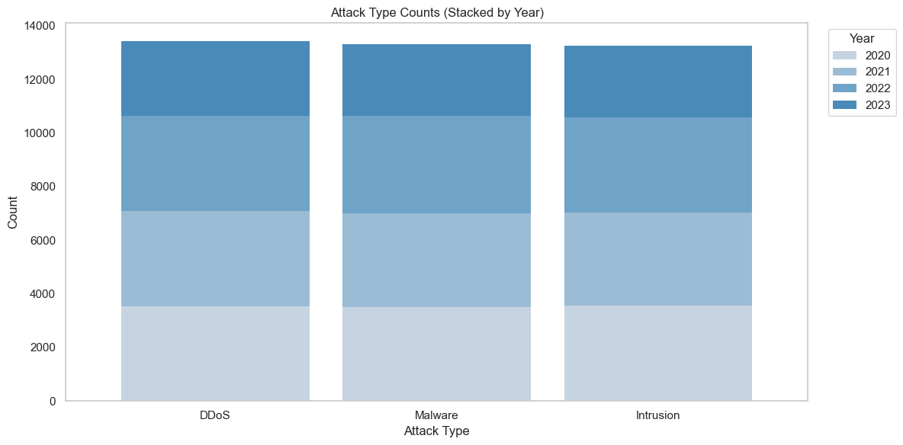
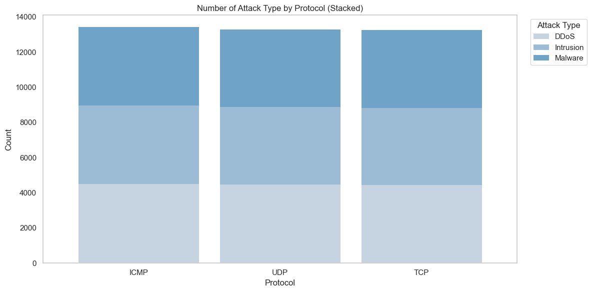
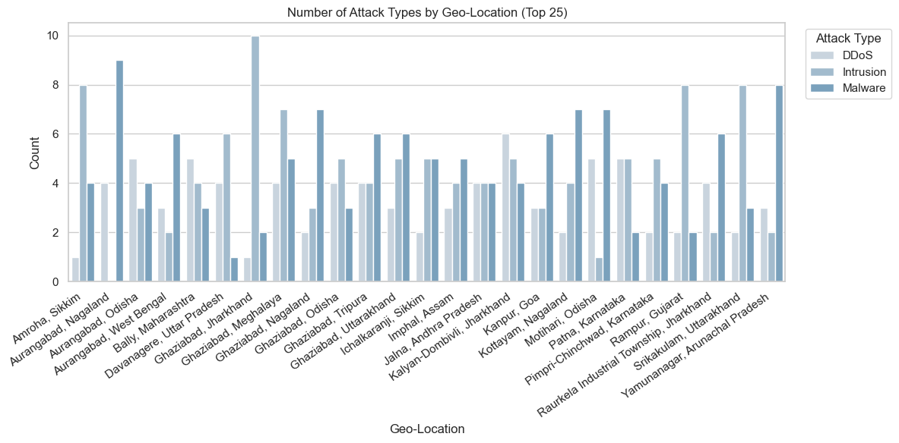
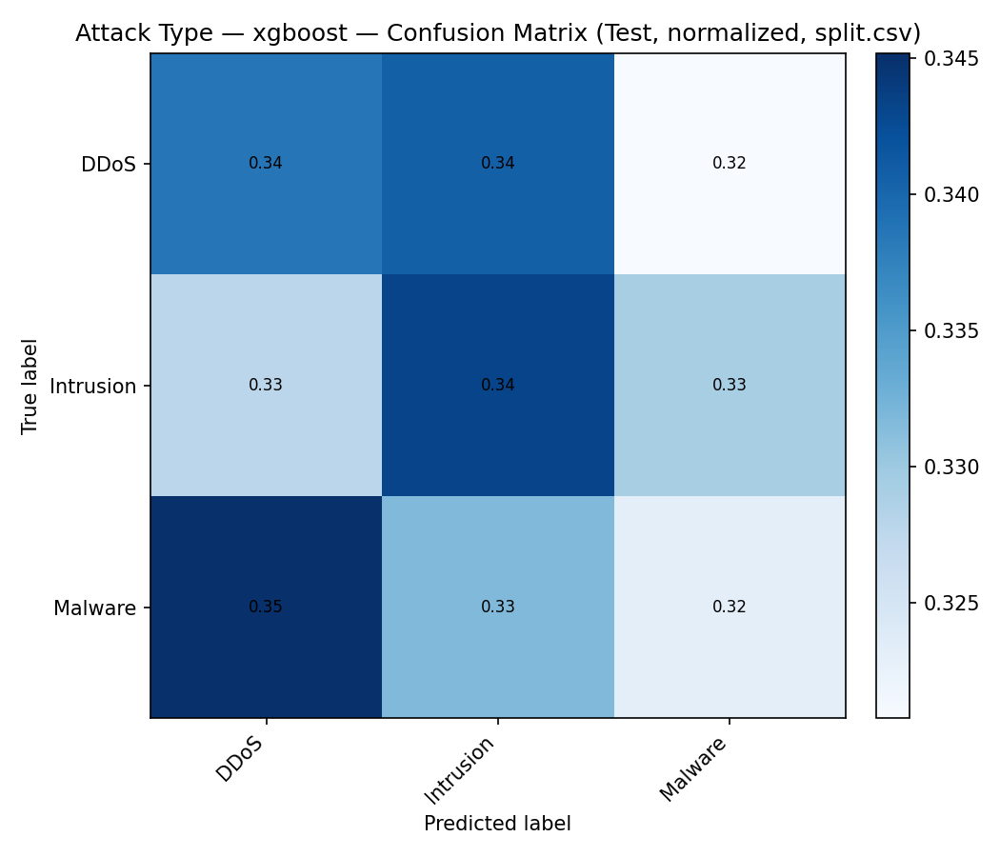
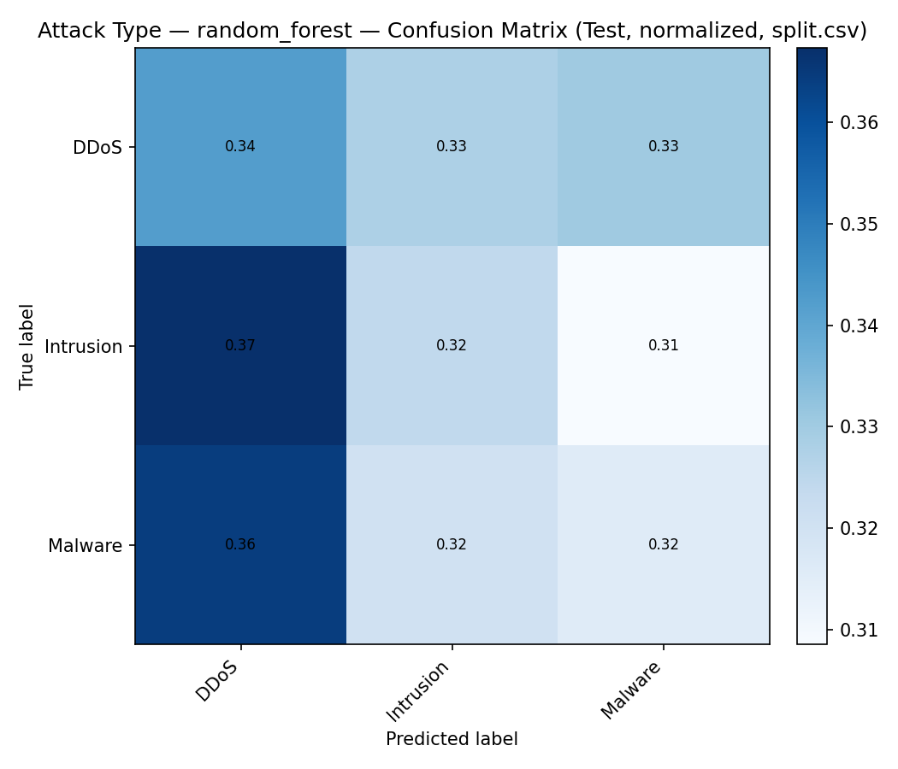
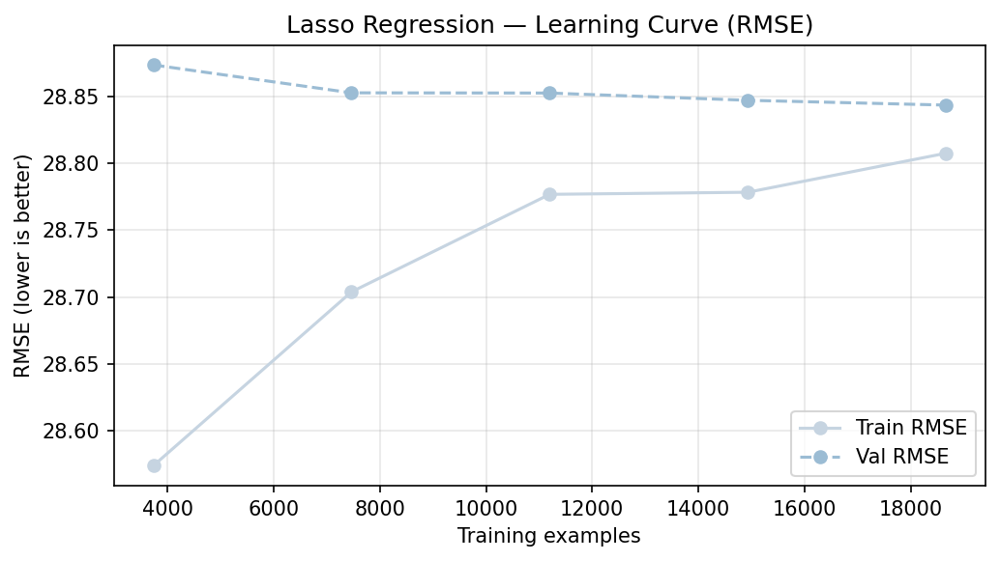
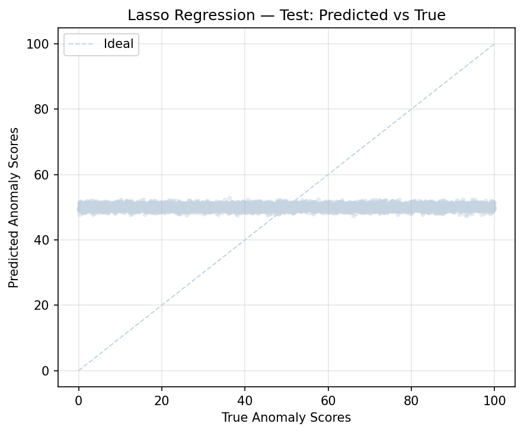
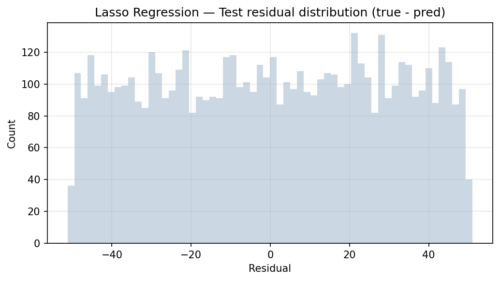

# ML Cybersecurity Attacks — Report

- **Project Title:** Cybersecurity Attacks — Attack Type Classification (with Anomaly Score Regression diagnostics)
- **Date:** 2025-12-30
- **Dataset Used:** `data/02-preprocessed/cybersecurity_attacks_v1_2025-12-29`

## 1: Introduction and Problem Definition

### 1.1 Problem description and motivation

Organizations collect large volumes of network telemetry (connection metadata, protocol, ports, user agent, device context, alerts) but still struggle to rapidly triage and route incidents. In this project we frame **Attack Type** as a supervised multiclass classification problem: given a single event record, predict whether it corresponds to **DDoS**, **Intrusion**, or **Malware**.

A realistic business context is a Security Operations Center (SOC) that needs to:

- Prioritize response playbooks (e.g., rate-limiting for DDoS vs. containment for malware).
- Route alerts to the right team (network engineering vs. endpoint/security engineering).
- Monitor shifts in attack patterns over time.

In parallel, the repository also includes a regression track that attempts to predict an **Anomaly Score**. This is treated as a secondary diagnostic task to understand whether the available baseline features carry usable signal for continuous risk scoring.

### 1.2 Project goals

- **Business goal:** Support faster and more consistent incident triage by automatically labeling events into actionable categories (DDoS / Intrusion / Malware).
- **Data-science goal:** Train and evaluate baseline models that predict `Attack Type` from the prepared dataset using a consistent feature configuration, then assess generalization on held-out data.

### 1.3 Dataset description

- **Rows / columns:** 40,000 rows, 26 columns.
- **Target classes:** 3 classes (`DDoS`, `Intrusion`, `Malware`).
- **Class distribution (overall):**
  - DDoS: 13,428
  - Intrusion: 13,265
  - Malware: 13,307
- **Splits:**
  - Training artifacts for the classification task use the prepared `split.csv` (train 28,000 / validation 6,000 / test 6,000).
  - A time-aware split (`split_time_70_15_15.csv`) also exists in the prepared dataset directory and is used elsewhere in the project.

#### Input modalities and key features

- Tabular data with categorical and numerical fields.
- Common predictive signals include: protocol, traffic type, browser/user agent-derived fields, action/alert indicators, and port-based features.

#### EDA summary (selected figures)

The exploratory analysis highlights how attack types distribute across time and metadata dimensions:

- Attack types over years

- Attack types by month

- Attack types by protocol

- Attack types by geo-location (top 25)

(These images were exported from the EDA notebook outputs for stable filename-based referencing.)

## 2: Methodology

### 2.1 Preprocessing Pipeline

Modeling follows a deterministic baseline feature configuration (`config/baseline_feature_config.json`) applied consistently to enable fair comparisons.

Key steps:

- **Column dropping:** remove high-cardinality or sensitive/free-text-like fields (e.g., IP addresses, payload/user/device details) and always exclude `row_id` and the target label.
- **Feature engineering:**
  - Timestamp-derived features: hour, day-of-week, month, and weekend indicator.
  - Port bucket features: well-known / registered / dynamic indicators for source and destination ports.
- **Missing value handling:**
  - Numerical: median imputation.
  - Categorical: most-frequent imputation.
- **Encoding:** one-hot encoding for categorical features.
- **Scaling:** used where appropriate for certain regressors (e.g., SVR/KNN); tree-based models do not require scaling.

### 2.2 Model architecture and justification

This project uses classical ML models implemented as scikit-learn pipelines:

- **Random Forest (classification):** strong baseline for tabular data, handles non-linearities and interactions.
- **XGBoost (classification):** gradient-boosted trees, often competitive on tabular problems.

For anomaly score regression, multiple baseline regressors are compared (linear models, tree ensembles, kernel methods) to test whether the baseline feature set can support meaningful continuous prediction.

### 2.3 Training strategy

- **Reproducibility:** fixed random seed.
- **Optimization:**
  - Tree ensembles train via their standard fitting procedures (no epoch-based training loop).
  - For regression models, learning curves are computed via cross-validation with an RMSE scoring function to understand bias/variance tradeoffs.
- **Metrics:**
  - Classification: accuracy, macro-F1, weighted-F1; confusion matrix.
  - Regression: MAE, RMSE, R²; plus diagnostic plots (predicted vs true, residuals, over time).

### 2.4 Performance validation

- **Splitting:** classification training runs persist metrics for `split.csv` (28k/6k/6k). This split is used for the quantitative tables and confusion matrices in this report.
- **Leakage controls:** target and row identifiers are removed from the feature matrix before modeling.
- **Notes on time-aware evaluation:** a chronological split file exists and is appropriate for deployment-oriented validation; it can be used in future iterations to stress-test temporal generalization.

## 3: Results and Evaluation

### 3.1 Quantitative results

#### Attack Type (classification) — validation and test metrics (split.csv)

| Model | Val Accuracy | Val Macro-F1 | Val Weighted-F1 | Test Accuracy | Test Macro-F1 | Test Weighted-F1 |
| --- | ---: | ---: | ---: | ---: | ---: | ---: |
| Random Forest | 0.3335 | 0.3335 | 0.3335 | 0.3273 | 0.3272 | 0.3273 |
| XGBoost | 0.3367 | 0.3367 | 0.3367 | 0.3350 | 0.3349 | 0.3349 |

#### Confusion matrices (test, normalized)

These confusion matrices were regenerated from the persisted `*.joblib` models on the `split.csv` test split so they align with the saved test metrics.

- XGBoost

- Random Forest

#### Per-class metrics (XGBoost on test split)

| Class | Precision | Recall | F1 | Support |
| --- | ---: | ---: | ---: | ---: |
| DDoS | 0.3371 | 0.3386 | 0.3379 | 2014 |
| Intrusion | 0.3363 | 0.3432 | 0.3397 | 1990 |
| Malware | 0.3314 | 0.3231 | 0.3272 | 1996 |

#### Anomaly Score (regression) — headline results

Across the compared baseline regressors, test RMSE values are tightly clustered and R² is near-zero or negative, indicating that the baseline feature set provides limited predictive signal for the anomaly score.

Example diagnostic plots (Lasso regression):

- Learning curve (RMSE)

- Predicted vs true

- Residuals

### 3.2 Interpretation of results

- **Attack Type:** With three nearly balanced classes, a naive baseline is ~0.33 accuracy. Both Random Forest and XGBoost land close to that baseline on the held-out test set, and the confusion matrices show weak diagonal dominance. This suggests substantial class overlap under the current baseline features.
- **No strong easy/hard class separation:** Per-class precision/recall values are similar across classes, consistent with a model that does not find a distinctive signal for any single class.
- **Anomaly Score regression:** The diagnostic plots show predictions concentrated in a narrow band relative to the full spread of true anomaly scores, consistent with near-zero/negative R².

### 3.3 Summary of final model performance

- **Best Attack Type model:** XGBoost by test macro-F1 (0.3349), but performance remains close to chance level for a 3-class task.
- **What this indicates:** Under baseline preprocessing and feature selection, the dataset is difficult for per-event multiclass classification; it likely requires richer features, temporal context, or improved label/feature quality to move beyond chance-level results.

## 4: Discussion and Reflection

### 4.1 Limitations and sources of error

- **Feature limitations:** Baseline features may be insufficient to disambiguate DDoS vs Intrusion vs Malware from a single event record.
- **Potential label ambiguity/noise:** Realistic cyber datasets often contain overlapping signatures and weakly labeled events.
- **Validation strategy:** Random splits (split.csv) can overestimate performance in some security settings; time-aware validation is important for deployment.

### 4.2 Potential improvements

1. **Richer feature engineering:** session-level aggregation features (counts per source, rolling rates, burstiness), protocol-specific flags, and interaction features.
2. **Temporal modeling:** incorporate sequences (e.g., event windows per entity) or time-aware features beyond simple timestamp components.
3. **Modeling upgrades:** stronger boosted-tree tuning, calibrated probabilities, or architectures designed for tabular + text (if user agent/payload can be safely reintroduced).

### 4.3 Reflection on what you learned

This work highlights how a clean, reproducible baseline is valuable even when performance is low: it establishes that, with the current feature set, both classification and regression tasks are challenging. The next iteration should focus on identifying higher-signal features and using validation strategies that reflect real-world deployment constraints (especially temporal generalization).
